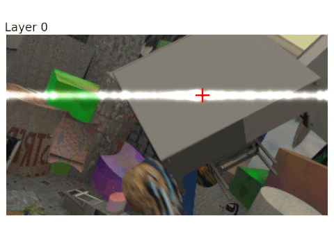
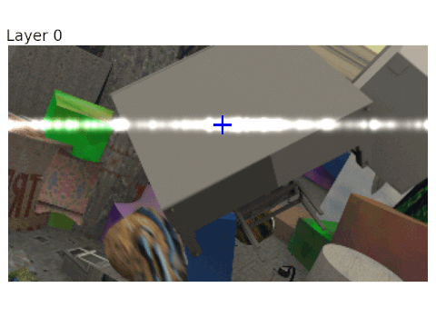
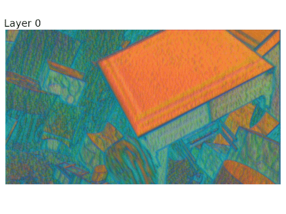
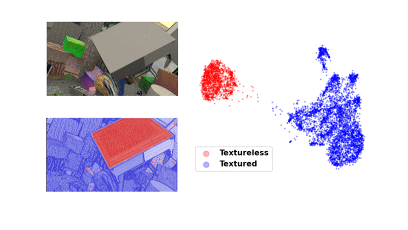

# STereo TRansformer (STTR)

This is the official repo for our work [Revisiting Stereo Depth Estimation From a Sequence-to-Sequence Perspective with Transformers](https://arxiv.org/abs/2011.02910).


Fine-tuned result on street scene:


Generalization to medical domain when trained only on synthetic data:


If you find our work relevant, please cite
```
@InProceedings{Li_2021_ICCV,
    author    = {Li, Zhaoshuo and Liu, Xingtong and Drenkow, Nathan and Ding, Andy and Creighton, Francis X. and Taylor, Russell H. and Unberath, Mathias},
    title     = {Revisiting Stereo Depth Estimation From a Sequence-to-Sequence Perspective With Transformers},
    booktitle = {Proceedings of the IEEE/CVF International Conference on Computer Vision (ICCV)},
    month     = {October},
    year      = {2021},
    pages     = {6197-6206}
}
```

## Update
- 2022.01.16: Resolved torch version compatibility issue in [Issue #8](https://github.com/mli0603/stereo-transformer/issues/8). A big thanks to @DeH40!
- 2021.03.29: Added code/instruction to obtain training data from Scene Flow. 
- 2021.01.13: STTR-light is released. Use branch `sttr-light` for the new model. 
- 2020.11.05: First code and arxiv release

## Table of Content
- [Introduction](https://github.com/mli0603/stereo-transformer#introduction)
    - [Benefits of STTR](https://github.com/mli0603/stereo-transformer#benefits-of-sttr)
    - [Working Theory](https://github.com/mli0603/stereo-transformer#working-theory)
- [Dependencies](https://github.com/mli0603/stereo-transformer#dependencies)
- [Pre-trained Models](https://github.com/mli0603/stereo-transformer#pre-trained-models)
- [Folder Structure](https://github.com/mli0603/stereo-transformer#folder-structure)
    - [Code](https://github.com/mli0603/stereo-transformer#code-structure)
    - [Data](https://github.com/mli0603/stereo-transformer#data-structure)
- [Usage](https://github.com/mli0603/stereo-transformer#usage)
    - [Colab/Notebook](https://github.com/mli0603/stereo-transformer#colabnotebook-example)
    - [Terminal Example](https://github.com/mli0603/stereo-transformer#terminal-example)
- [Expected Result](https://github.com/mli0603/stereo-transformer#expected-result)
- [Common Q&A](https://github.com/mli0603/stereo-transformer#common-qa)
- [License](https://github.com/mli0603/stereo-transformer#license)
- [Contributing](https://github.com/mli0603/stereo-transformer#contributing)
- [Acknowledgement](https://github.com/mli0603/stereo-transformer#acknowledgement)

## Introduction
#### Benefits of STTR
STereo TRansformer (STTR) revisits stereo depth estimation from a sequence-to-sequence perspective. The network combines conventional *CNN* feature extractor and long-range relationship capturing module *Transformer*. STTR is able to relax prior stereo depth estimation networks in three aspects:

- Disparity range naturally scales with image resolution, no more manually set range.
- Explicit occlusion handling.
- Imposing uniqueness constraint.
 
STTR performs comparably well against prior work with refinement in [Scene Flow](https://lmb.informatik.uni-freiburg.de/resources/datasets/SceneFlowDatasets.en.html) and [KITTI 2015](http://www.cvlibs.net/datasets/kitti/eval_scene_flow.php?benchmark=stereo). STTR is also able to generalize to [MPI Sintel](http://sintel.is.tue.mpg.de/stereo), [KITTI 2015](http://www.cvlibs.net/datasets/kitti/eval_scene_flow.php?benchmark=stereo), [Middlebury 2014](https://vision.middlebury.edu/stereo/data/scenes2014/) and [SCARED](https://endovissub2019-scared.grand-challenge.org/) when trained only on synthetic data.  

#### Working Theory
##### Attention
Two types of attention mechanism are used: self-attention and cross-attention. Self-attention uses context within the same image, while cross-attention uses context across two images. The attention shrinks from global context to local context as the layer goes deeper. Attention in a large textureless area tends to keep attending dominant features like edges, which helps STTR to resolve ambiguity.

Self-Attention


Cross-Attention
   

##### Relative Positional Encoding
We find that only image-image based attention is not enough. Therefore, we opt in relative positional encoding to provide positional information. This allows STTR to use the relative distance from a featureless pixel to dominant pixel (such as edge) to resolve ambiguity. In the following example, STTR starts to texture the center of the table using relative distance, thus strides parallel to the edges start to show.

Feature Descriptor



##### Implicit Learnt Feature Classification
We observe that the feature extractor before Transformer actually learns without any explicit supervision to classify pixels into two clusters - textured and textureless. We hypothesize that this implicit learnt classification helps STTR to generalize.

Implicit Learnt Classification


## Dependencies
We recommend the following steps to set up your environment
- Create your python virtual environment by 
    ``` sh
    conda create --name sttr python=3.6 # create a virtual environment called "sttr" with python version 3.6
    ```
    (Python version >= 3.6)
- **Install Pytorch**: Please follow link [here](https://pytorch.org/get-started/locally/).

     (PyTorch version >= 1.5.1)
  
- **Other third-party packages**: You can use pip to install the dependencies by 
    ```sh
    pip install -r requirements.txt
    ``` 
- **(*Optional*) Install Nvidia apex**: We use apex for mixed precision training to accelerate training. To install, please follow instruction [here](https://github.com/NVIDIA/apex)
    - You can **remove** apex dependency if 
        - you have more powerful GPUs, or
        - you don't need to run the training script.
    - Note: We tried to use the native mixed precision training from official Pytorch implementation. However, it currently does *not* support *gradient checkpointing* for **LayerNorm**. We will post update if this is resolved.
## Pre-trained Models
You can download the pretrained model from the following links.

- Google Drive:

|               Models               |  Link    | 
|:--------------------------         |:---------:|
| **STTR** (Scene Flow pretrained)       |  [Download link](https://drive.google.com/file/d/1R0YUpFzDRTKvjRfngF8SPj2JR2M1mMTF/view?usp=sharing)    |
| **STTR** (KITTI finetuned)             |  [Download link](https://drive.google.com/file/d/1UUESCCnOsb7TqzwYMkVV3d23k8shxNcE/view?usp=sharing)    |
| **STTR-light** (Scene Flow pretrained) |  [Download link](https://drive.google.com/file/d/1MW5g1LQ1RaYbqeDS2AlHPZ96wAmkFG_O/view?usp=sharing)    |

- Baidu download link:
  - Link: https://pan.baidu.com/s/1euozEOX3fVdYID3v5dHJ_w
  - Password: `jvda`

## Folder Structure
#### Code Structure
```
stereo-transformer
    |_ dataset (dataloder)
    |_ module (network modules, including loss)
    |_ utilities (training, evaluation, inference, logger etc.)
```
 
#### Data Structure
Please see [sample_data](sample_data) folder for details. We keep the original data folder structure from the official site. If you need to modify the existing structure, make sure to modify the dataloader.

- Note: We only provide one sample of each dataset to run the code. We do not own any copyright or credits of the data.

Scene Flow 
```
FlyingThings3D
    |_ RGB_finalpass
        |_ TRAIN
            |_ A
                |_0000
    |_ disparity
        |_ TRAIN
            |_ A
                |_0000
    |_ occlusion
        |_ TRAIN
            |_ left
```

MPI Sintel
```
MPI_Sintel
    |_ training
        |_ disparities
        |_ final_left 
        |_ final_right 
        |_ occlusions (occlusions of left border of objects)
        |_ outofframe (occlusion of left border of images)
```

KITTI 2015
```
KITTI_2015
    |_ training
        |_ disp_occ_0 (disparity including occluded region)
        |_ image_2 (left image)
        |_ image_3 (right image)
```

MIDDLEBURY_2014
```
MIDDLEBURY_2014
    |_ trainingQ
        |_ Motorcycle (scene name)
            |_ disp0GT.pfm (left disparity)
            |_ disp1GT.pfm (right disparity)
            |_ im0.png (left image)
            |_ im1.png (right image)
            |_ mask0nocc.png (left occlusion)
            |_ mask1nocc.png (right occlusion)
```

SCARED
```
SCARED
    |_ training
        |_ disp_left
        |_ img_left 
        |_ img_right
        |_ occ_left 
```

## Usage
#### Colab/Notebook Example
If you don't have a GPU, you can use Google Colab:
- An example of how to run inference is given in the Colab example [](https://colab.research.google.com/github/mli0603/stereo-transformer/blob/main/scripts/inference_example_colab.ipynb)

If you have a GPU and want to run locally:
- Download pretrained model using links in [Pre-trained Models](https://github.com/mli0603/stereo-transformer#pre-trained-models). 
  - Note: The pretrained model is assumed to be in the `stereo-transformer` folder.
- An example of how to run inference is given in file [inference_example.ipynb](scripts/inference_example.ipynb).

#### Terminal Example
- Download pretrained model using links in [Pre-trained Models](https://github.com/mli0603/stereo-transformer#pre-trained-models).
- Run pretraining by
    ```
    sh scripts/pretrain.sh
    ```
    - Note: please set the `--dataset_directory` argument in the `.sh` file to where Scene Flow data is stored, i.e. replace `PATH_TO_SCENEFLOW`
- Run fine-tune on KITTI by
    ```
    sh scripts/kitti_finetune.sh
    ```
    - Note: please set the `--dataset_directory` argument in the `.sh` file to where KITTI data is stored, i.e. replace `PATH_TO_KITTI`
    - Note: the pretrained model is assumed to be in the `stereo-transformer` folder. 
- Run evaluation on the provided KITTI example by
    ```
    sh scripts/kitti_toy_eval.sh
    ```
    - Note: the pretrained model is assumed to be in the `stereo-transformer` folder. 

## Expected Result
The result of STTR may vary by a small fraction depending on the trial, but it should be approximately the same as the tables below.
 
Expected result of STTR (`sceneflow_pretrained_model.pth.tar`) and STTR-light (`sttr_light_pretrained_model.pth.tar`).

Sceneflow

|            	|    **3px Error** 	|       **EPE**     | **Occ IOU**     |
|:----------:	|:---------------:	|:---------------:  |:---------------:|
|**STTR** |       **1.26**    |       **0.45**   	|        0.92     |
|**STTR-light** |       1.54    	|       0.50     	|     **0.97**    |

Generalization without fine-tuning.

|               | MPI Sintel | | |    KITTI 2015   	|                	| |  Middleburry-Q  	| |                 	| SCARED    |      	|                 	|
|:----------:   |:---------------: |:---------------: |:---------------:|:---------------:|:---------------:|:---------------:|:---------------:	|:--------------: |:---------------:	|:------:	|:-----------------:	|:-----------------:	|
|            	|  **3px Error** |       **EPE** | **Occ IOU** |    **3px Error** 	|       **EPE** |**Occ IOU** |    **3px Error** 	|       **EPE**    	| **Occ IOU**|    **3px Error**  |       **EPE** |**Occ IOU**   |   **3px Error**	|  **EPE** 	|    **Occ IOU** |
|**STTR**       | **5.75** | 3.01    | **0.86** |    **6.74**     	|      **1.50**      	|  **0.98**  |   6.19      	|       2.33      	| **0.95** | 3.69 | 1.57  	| **0.96**
|**STTR-light** | 5.82     | **2.95**| 0.69 | 7.20 	| 1.56 	| 0.95 | **5.36**	| **2.05** | 0.76 | **3.30**  | **1.19** 	| 0.89 

Expected 3px error result of `kitti_finetuned_model.pth.tar` 

Dataset | 3px Error | EPE
:--- | :---: | :---: 
KITTI 2015 training | 0.79 | 0.41
KITTI 2015 testing | 2.01 | N/A

## Common Q&A
1. I don't see occlusion from Scene Flow dataset. What should I do?\
   Scene Flow dataset can be downloaded at [https://lmb.informatik.uni-freiburg.de/resources/datasets/SceneFlowDatasets.en.html](https://lmb.informatik.uni-freiburg.de/resources/datasets/SceneFlowDatasets.en.html). However, you may notice that the **Full datasets** has disparity and images, but not occlusion. What you need to do is to download the occlusion from the **DispNet/FlowNet2.0 dataset subsets** and use the provided training list on the right named **train** to only use the subset of **Full datasets** with the occlusion data. Please see `utilities/subsample_sceneflow.py` for more details of subsampling the Full datasets.

2. How much memory does it require to train/inference?\
    We provide a flexible design to accommodate different hardware settings. 
    - For both training and inference, you change the `downsample` parameter to reduce memory consumption at the cost of potential performance degradation.  
    - For training, you can always change the crop size in `dataset/scene_flow.py`.
    - For both training and inference, you can use the light-weight model [STTR-light](https://github.com/mli0603/stereo-transformer/tree/sttr-light).
    
3. What are occluded regions?\
    "Occlusion" means pixels in the left image do not have a corresponding match in right images. Because objects in *right image* are shifted to the *left* a little bit compared to the *right image*, thus pixels in the following two regions generally do not have a match:
     - At the *left border of the left image* 
     - At the *left border of foreground objects* 

4. Why there are black patches in predicted disparity with values 0?\
    The disparities of occluded region are set to 0. 

5. Why do you read disparity map including occluded area for KITTI during training?\
    We use random crop as a form of augmentation, thus we need to recompute occluded regions again. The code for computing occluded area can be found in [dataset/preprocess.py](dataset/preprocess.py).

6. How to reproduce feature map visualization in Figure 4 of the paper?\
    The feature map is taken after the first LayerNorm in Transformer. We use PCA trained on the first and third layer to reduce the dimensionality to 3.
   
    
## License
This project is under the Apache 2.0 license. Please see [LICENSE](LICENSE.txt) for more information.
 
## Contributing
We try out best to make our work easy to transfer. If you see any issues, feel free to fork the repo and start a pull request. 


## Acknowledgement
Special thanks to authors of [SuperGlue](https://github.com/magicleap/SuperGluePretrainedNetwork), [PSMNet](https://github.com/JiaRenChang/PSMNet) and [DETR](https://github.com/facebookresearch/detr) for open-sourcing the code.
We also thank GwcNet, GANet, Bi3D, AANet for open-sourcing the code. We thank Xiran for MICCAI pre-processing.
